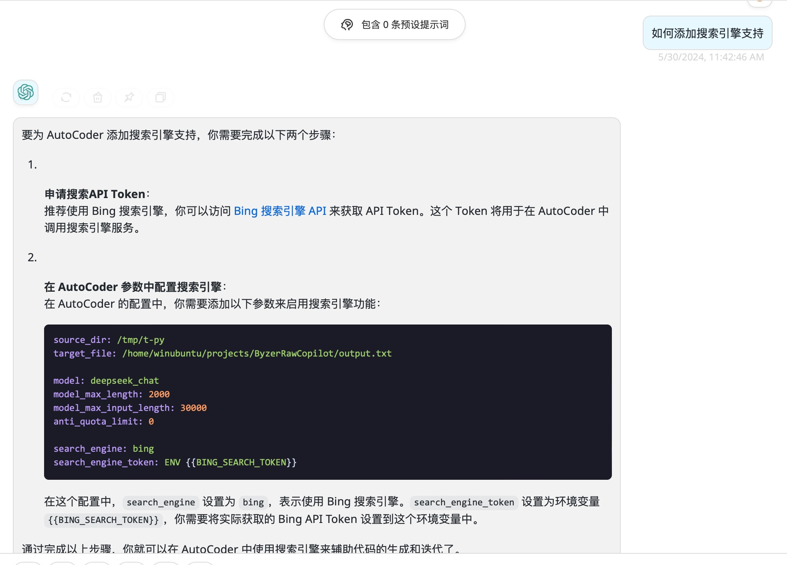

# 000-AutoCoder_Prepare_Journey

This article will introduce how to quickly set up auto-coder for your existing project using SaaS API.

## Install auto-coder

```shell
conda create --name auto-coder python=3.10.11
conda activate auto-coder
pip install -U auto-coder
ray start --head
```

## Start recommended model agents

For the large language model (you need to apply for a token on the deepseek website), execute the following command.

> Be sure to replace `${MODEL_DEEPSEEK_TOKEN}` and `${MODEL_QIANWEN_TOKEN}` with your actual tokens.

```shell
byzerllm deploy --pretrained_model_type saas/openai \
--cpus_per_worker 0.001 \
--gpus_per_worker 0 \
--worker_concurrency 30 \
--num_workers 1 \
--infer_params saas.base_url="https://api.deepseek.com/v1" saas.api_key=${MODEL_DEEPSEEK_TOKEN} saas.model=deepseek-chat \
--model deepseek_chat
```

For the vector model (optional, you need to apply for a token on the qwen website, you can skip this step if it's too complicated), execute the following command.

```shell
byzerllm deploy --pretrained_model_type saas/qianwen \
--cpus_per_worker 0.001 \
--gpus_per_worker 0 \
--num_workers 2 \
--infer_params saas.api_key=${MODEL_QIANWEN_TOKEN}  saas.model=text-embedding-v2 \
--model qianwen_emb
```

## Initialize existing project

Navigate to your project's root directory and execute the following command.

```shell
auto-coder init --source_dir .
```
The system will automatically generate `.auto-coder` and `actions` directories in the current directory.
In the actions directory, a `101_current_work.yaml` file will be generated, which you can use as a template.

Remember to modify your `project_type` in `actions/base/base.yml` or in your independent YAML file, supporting:

1. py
2. ts
3. Any combination of file extensions, separated by commas, for example: .java, .scala

## Start your journey

[002- Using AutoCoder to Add and Modify Code](./002-%20Using%20AutoCoder%20to%20Add%20and%20Modify%20Code.md)

## Build a local auto-coder assistant for yourself

This step depends on the vector model started earlier.

Start the knowledge base:

```shell
byzerllm storage start
```

Import auto-coder documents:

```shell
git clone https://github.com/allwefantasy/auto-coder
cd auto-coder 
auto-coder doc build --model deepseek_chat --emb_model qianwen_emb --source_dir ./docs/zh --collection auto-coder --description "AutoCoder Documentation"
```

Wait a few minutes for it to finish.

Now you can chat with the assistant:

```shell
auto-coder doc query --model deepseek_chat --emb_model qianwen_emb --query "How to start a search engine" --collection auto-coder
```

You can also start a service for easier use with some chat software:

```shell
auto-coder doc serve --model deepseek_chat --emb_model qianwen_emb  --collection auto-coder
```

Here are some examples of the effects:
     


Taking NextChat software as an example, the configuration is as follows:


The password can be filled in randomly.