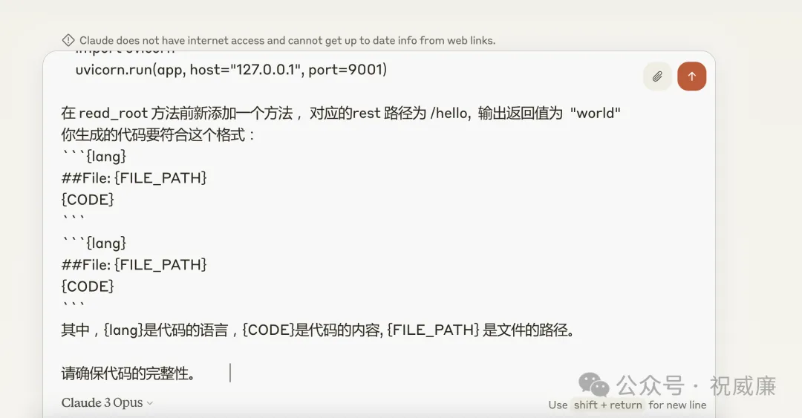
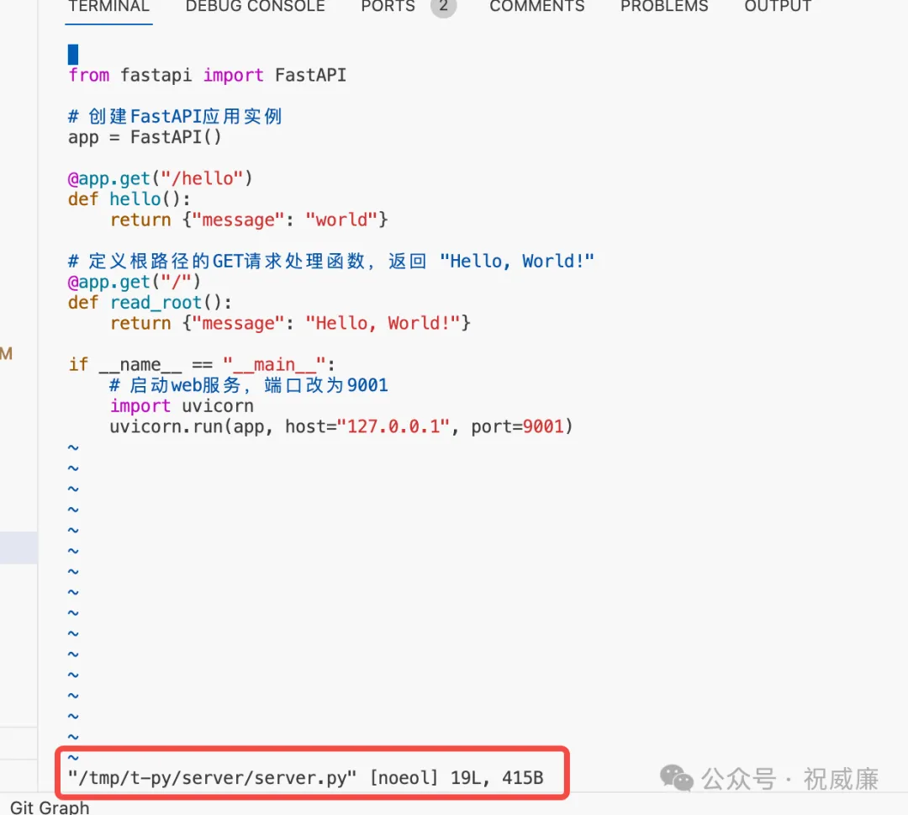
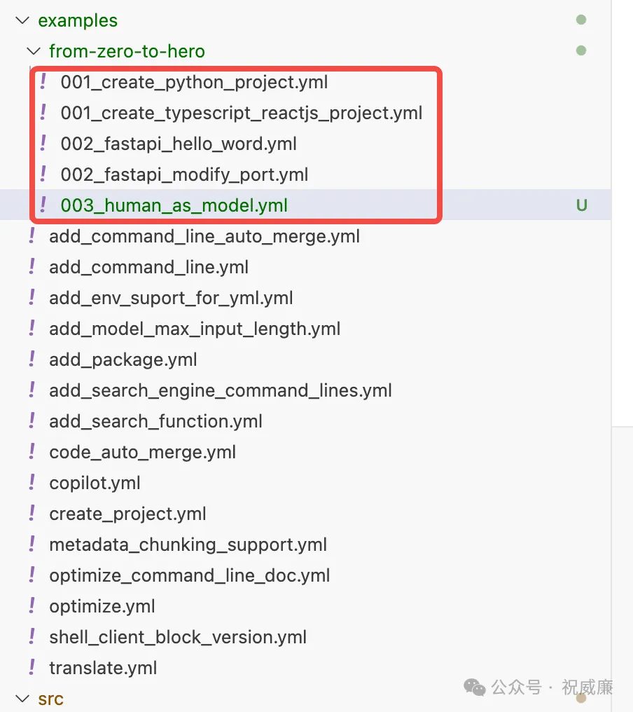

# 003 - AutoCoder Usage with Web-based Large Models, the Sexy Human As Model Mode

Previously, we discussed how AutoCoder can assist you in programming when you lack an API version of a large model, or your API-based large model is not powerful enough, and you only have access to web versions like Kimi/GPT4. Here are two methods:

The first method is to remove the `execute/auto_merge` parameters. At this point, you can find your prompt in the `target_file` and simply drag and drop it into the web version. The generated code can essentially be copied and pasted directly.

However, you might prefer that AutoCoder still handle automatic merging and other processes. What should you do? We introduce a new parameter called `human_as_model`. Let's see how to use it:

```yml
source_dir: /tmp/t-py
target_file: /home/winubuntu/projects/ByzerRawCopilot/output.txt 

model: qianwen_chat
model_max_length: 2000
model_max_input_length: 6000
anti_quota_limit: 5

search_engine: bing
search_engine_token: ENV {{BING_SEARCH_TOKEN}}

## Execute the prompt generated by auto-coder
execute: true
## Extract the code from the prompt generated by auto-coder
## and overwrite the source code
auto_merge: true

project_type: py

human_as_model: true

query: >
  Add a new method before the read_root method,
  with the corresponding REST path as /hello, 
  and the output should return "world"
```
Here, compared to before, there is an additional `human_as_model` parameter, which we set to `true`. Now we want to add a new HTTP interface. Execute our requirement as follows:

```shell
auto-coder --file ./examples/from-zero-to-hero/003_human_as_model.yml
```

At this point, the terminal automatically enters interactive mode:


It prompts you that the problem has been saved to the output.txt file, and you are asked to respond to this question. At this time, I paste the question to Claude:



Claude generates the following code:


Now we copy it, making sure to copy the entire response, not just the code. After copying, it looks like this:


At the end, EOF indicates that you have finished pasting, and then press Enter.

When you open the `server.py` file again, the content has been updated:



We have added a new interface.

As your project's completion level increases, the model's generative capabilities will also become stronger, as there is more information available, which can directly help you generate business code.

Here is the translation of the provided Chinese text into English:

## How to Handle Multiple File Modifications

Because the generation length of large models is usually limited and much shorter than the input (especially in the web version), you can activate the following parameter:

```yaml
enable_multi_round_generate: false
```

Then,

1. When you paste the prompt into the web version, it will only generate code for one file, which you should then paste into AutoCoder, ending with a new line EOF.
2. At this point, AutoCoder will not stop; it will continue to provide you with new prompts to paste.
3. Repeat this cycle until your requirements are met.

## Summary

We can also see that the requirements for a single request should not be too large, otherwise, the results may become uncontrollable. In the future, developing code will be a process like this:



Each requirement is a piece of text that everyone can understand. How much change has been made and what each change entails are essentially textualized, which is a significant advantage for both product development and research and development.

Combined with Git's version control, it ensures the safety of AutoCoder, and through the Test test suite, it guarantees the correctness of AutoCoder.

Next time, we will introduce how to incorporate documentation and search engines, allowing AutoCoder to read the code you have already written, and then reference documentation and perform searches to complete the final code writing for the requirements.