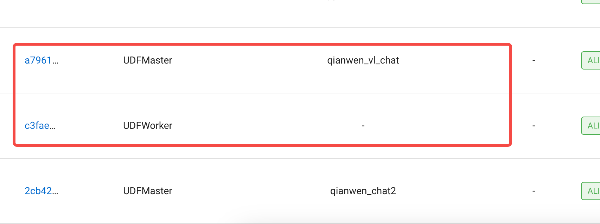

# How to Use AutoCoder at the Company Level

AutoCoder, when used by programmers, typically runs on their own computers in conjunction with a SaaS large model. Programmers can also use the Web version of the model through the human-as-model mode.

However, this method poses certain risks of source code leakage.

If a company wishes to provide its programmers with unified access to AutoCoder and has high requirements for code privacy, it may consider deploying the large model used by AutoCoder on a private basis.


## Private Deployment of Large Models

Byzer-LLM can quickly assist enterprises in deploying production-ready large model clusters, supporting mainstream SaaS, open-source large models, and multimodal large models. For more information, refer to https://github.com/allwefantasy/byzer-llm.

The first step is to form a cluster with the company's servers using Ray, which can be referred to at https://docs.ray.io/en/latest/. Ray can run on bare metal, in the cloud, or on Kubernetes, depending on the company's IT infrastructure requirements.

Then, you can execute the following command on Ray to start a large model:

```
byzerllm deploy --model_path /home/byzerllm/models/openbuddy-llama2-13b64k-v15 \
--pretrained_model_type custom/auto \
--gpu_gpus_per_worker 4 \
--num_workers 1 \
--model llama2_chat 
```

Afterward, you can see the launched large model on Ray's dashboard:



The above command indicates that we are using a custom model located at `/home/byzerllm/models/openbuddy-llama2-13b64k-v15`, which is a 13B model utilizing 4 GPUs, with one worker launched. If you set up two workers, it's equivalent to using 8 cards.

Note, for AutoCoder to perform well, it's recommended to use at least the 72B Qwen model with a long window version.

Worth mentioning, we offer tools for quick environment setup on servers without even graphics card drivers: https://github.com/allwefantasy/byzer-llm?tab=readme-ov-file#raw-machine

In fact, Byzer-LLM treats both private large models and SaaS models equally, launching workers in the Ray cluster. The difference is that SaaS models do not consume GPUs, and connecting to SaaS models through Byzer-LLM is also important for better control, such as for auditing, and managing model versions more effectively. For instance, switching models requires only server-side changes, not client modifications.

## AutoCoder Client Configuration

Once the server deployment is complete, programmers can install the AutoCoder client on their computers and connect to the Byzer-LLM cluster in two ways:

The first method is to start a client proxy as follows:

```shell
ray start --address='Company Byzer-LLM cluster address'
```                    
Then you can normally use AutoCoder, for example:

```yml
source_dir: /home/winubuntu/projects/ByzerRawCopilot 
target_file: /home/winubuntu/projects/ByzerRawCopilot/output.txt 

model: qianwen_short_chat
model_max_length: 2000
anti_quota_limit: 5
skip_build_index: true

project_type: "copilot/.py"
query: |
  Optimize the get_suffix_from_project_type function in copilot and update the original file

```

At this time, AutoCoder will automatically connect to the deployed `qianwen_short_chat` in the Byzer-LLM cluster to drive the process.

The second method is to specify the company's Byzer-LLM cluster address through a configuration file:

```yml
source_dir: /home/winubuntu/projects/ByzerRawCopilot 
target_file: /home/winubuntu/projects/ByzerRawCopilot/output.txt 

ray_address: Company Byzer-LLM cluster address

model: qianwen_short_chat
model_max_length: 2000
anti_quota_limit: 5
skip_build_index: true

project_type: "copilot/.py"
query: |
  Optimize the get_suffix_from_project_type function in copilot and update the original file
```       

Users can choose one of these methods according to their needs.

## Summary

AutoCoder, through the private deployment of large models, can meet the company's requirements for code privacy, while also allowing programmers to use the latest large models.