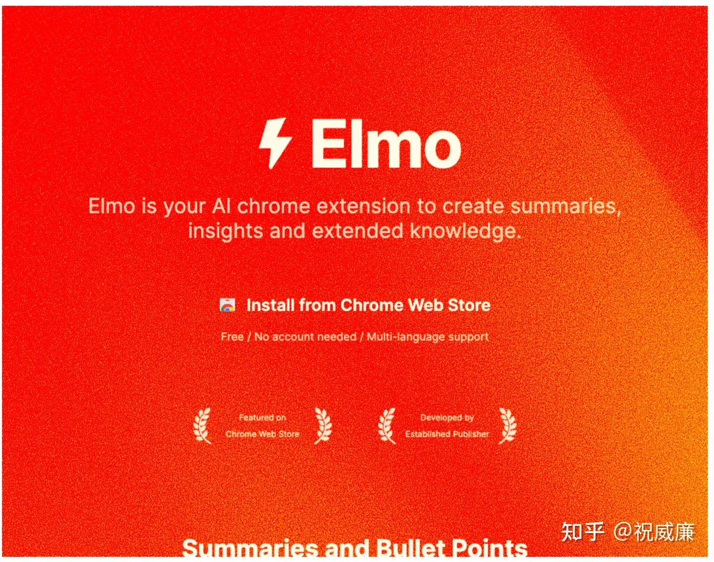
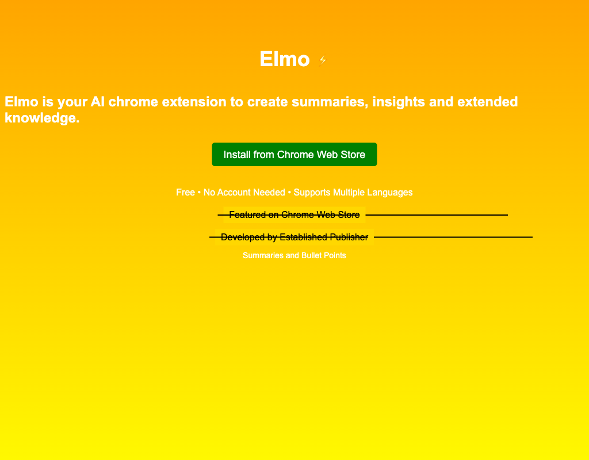

# 016-AutoCoder: How to Generate ReactJS+TypeScript+Tailwind Code from an Image

> AutoCoder >= 0.1.25 Features

This functionality is useful in scenarios such as when you have a ReactJS + TypeScript + Tailwind project, and you want to reference a page from another website. At that point, you can take a screenshot and then generate the corresponding ReactJS + TypeScript + Tailwind code based on that image.

Let's look at the following example:

```yml
source_dir: /Users/allwefantasy/projects/tt/
target_file: /Users/allwefantasy/projects/auto-coder/output.txt 
project_type: copilot/ts
image_file: /Users/allwefantasy/projects/auto-coder/screenshots/www_elmo_chat.png

model: qianwen_chat
model_max_length: 2000
model_max_input_length: 6000
anti_quota_limit: 5

vl_model: qianwen_vl_chat

skip_build_index: false
execute: true
auto_merge: true
human_as_model: true

query: |   
   Convert HTML to ReactJS+TypeScript+Tailwind implementation, and save it in the appropriate directory under /Users/allwefantasy/projects/tt/.
tt is already a ReactJS + TypeScript + Tailwind project.
```

Compared to previous projects, there are a few differences here:

1. Specify the webpage image address, which can be set through `image_file`.
2. The project configuration type is: `copilot/ts` instead of `ts`.
3. An additional multimodal model is specified, which can be set through `vl_model`.
4. The multimodal model needs to be deployed using byzerllm.

By default, AutoCoder will convert the image into HTML/CSS format, then convert it into the desired form through the query. For example, in our case, it's ReactJS+TypeScript+Tailwind, while in other cases, it might be Vue, etc.

The specified image `www_elmo_chat.png` looks like this:



The generated intermediate HTML looks like this:



You can see that the overall layout and such are recognized, just the color scheme is a bit off, and many details are lost. However, with the development of multimodal large models, the effects are bound to get better. We also support setting the number of iterations to approximate the original image, by default one time, but this parameter is not yet open to the public.

Finally, the generated ReactJS code looks like this:

```jsx
import React from 'react';
import tw from 'tailwind-styled-components';

const Container = tw.div`
  bg-gradient-to-b from-orange to-yellow
  text-white
  font-Arial
  flex
  flex-col
  items-center
  pt-50
  min-h-screen
`;

const Title = tw.h1`
  text-3xl
  mb-20
`;

const Subtitle = tw.h2`
  text-2xl
  mb-30
`;

const InstallButton = tw.button`
  bg-green
  text-white
  border-none
  px-10 py-2
  font-semibold
  cursor-pointer
  rounded-lg
  mb-20
`;

const GoldRibbon = tw.div`
  bg-gold
  text-black
  font-medium
  px-5 py-2
  relative
  mb-10
`;

const RibbonBeforeAfter = tw.div`
  absolute
  w-full
  h-2
  bg-black
  top-1/2
  transform -translate-y-1/2
`;

const RibbonBefore = tw(RibbonBeforeAfter)`
  left[-10px]
  right[100%]
`;

const RibbonAfter = tw(RibbonBeforeAfter)`
  left[100%]
  right[-10px]
`;

const FooterText = tw.p`
  text-base
  mb-20
`;

const ElmoChat: React.FC = () => (
  <Container>
    <Title>
      Elmo{' '}
      <span role="img" aria-label="Electric Spark">
        ⚡
      </span>
    </Title>
    <Subtitle>
      Elmo is your AI chrome extension to create summaries, insights and extended knowledge.
    </Subtitle>
    <InstallButton onClick={() => window.open('https://chrome.google.com/webstore/detail/elmo/your-extension-id')}>
      Install from Chrome Web Store
    </InstallButton>
    <p>Free • No Account Needed • Supports Multiple Languages</p>

    <GoldRibbon>Featured on Chrome Web Store</GoldRibbon>
    <GoldRibbon>Developed by Established Publisher</GoldRibbon>

    <FooterText>Summaries and Bullet Points</FooterText>
  </Container>
);

export default ElmoChat;
``

`

Then continue to modify and iterate on this page using AutoCoder as needed.