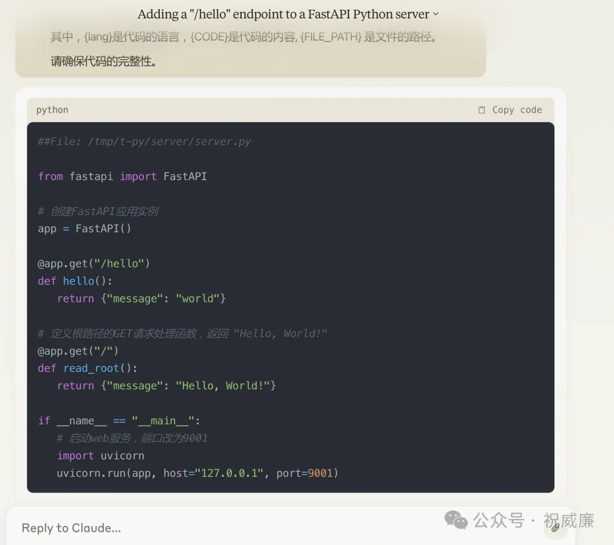

# 003- AutoCoder 使用Web版大模型，性感的Human As Model 模式

前面我们提到，如何解决你没有API版大模型，或者你的API版大模型太弱，而你只有Web版本的诸如 Kimi/GPT4 的情况下，改如何让AutoCoder帮助你完成编程？

我们有两个办法，第一个是去掉 execute/auto_merge 两个参数。这个时候你可以在 target_file 里找到你的prompt,拖拽到 Web版里就行。生成的代码，你基本上可以直接复制黏贴过来。

但是，你可能希望比如自动合并等环节还是让 AutoCoder做掉，该怎么办呢？这里我们有一个新参数叫 human_as_model。我们来看看怎么用：

```yml
source_dir: /tmp/t-py
target_file: /home/winubuntu/projects/ByzerRawCopilot/output.txt 

model: qianwen_chat
model_max_length: 2000
model_max_input_length: 6000
anti_quota_limit: 5

search_engine: bing
search_engine_token: ENV {{BING_SEARCH_TOKEN}}

## execute the prompt generated by auto-coder
execute: true
## extract the code from the prompt generated by auto-coder 
## and overwrite the source code
auto_merge: true

project_type: py

human_as_model: true

query: >
  在 read_root 方法前新添加一个方法，
  对应的rest 路径为 /hello, 
  输出返回值为  "world"  
```
这里相比以前，就多了一个 human_as_model 参数，我们把他设置为 true。现在我们希望添加一个新的http 接口。执行下我们的需求：

```shell
auto-coder --file ./examples/from-zero-to-hero/003_human_as_model.yml
```

这个时候终端会自动进入交互模式：


他提示你，他已经把问题保存到了 output.txt 文件里了，你来回答下这个问题。我这个时候把问题贴给 Claude:


Calude 生成了下面的代码：



现在我们复制下，注意要复制整个回复，而不是复制代码，复制完成后是这样子的：


在最后EOF 表示你黏贴完了，再按回车。

这个时候你再打开 server.py 文件，内容已经更新了：


我们新增了一个新的接口。

当你的项目完成度越高，模型的生成能力也会越强，因为有更多的新，从而可以直接帮你完成业务代码的生成。

## 如何应对多文件修改

因为大模型生成长度通常是有限制的，而且远远小于（尤其是在web版里）输入。这个时候，你可以开启下面的参数：

```yaml
enable_multi_round_generate: false
```

此时，

1. 当你把prompt黏贴到web版里，只会生成一个文件的的代码，你把生成的代码你黏贴到 auto-coder 里，然后以新行 EOF  结尾
2. 此时AutoCoder 不会结束，会继续给你新的Prompt 让你黏贴
3. 这样循环往复，直到你的需求完成。

## 总结

我们也可以看到，单次需求不要太大，否则会导致结果不可控。未来开发代码，会是这么一个流程：


每个需求都是一段文本，每个人都看得懂。做了多少变更，每个变更是什么，基本上都文本化了，对于产品，或者研发而言都是很大的利好。

同时配合 Git 的版本管理，保证AutoCoder的安全性，通过 Test 测试集，保证 AutoCoder的正确性。

下期，我们来介绍下，如何引入文档和搜索引擎，让AutoCoder 在阅读你已经写好的代码同时，再参考文档和自己去做搜索，来完成最终需求的代码编写。
