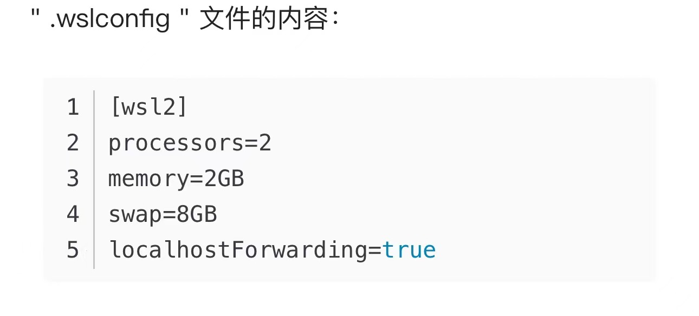

# 043_AutoCoder_Windows安装

Windows 下安装有两种方式。

1. 直接安装
2. 通过WSL安装

## 直接安装

经过测试：

1. Windows 7/10 可以正常安装。
2. Windows 11 家庭版有用户反馈存在一定问题。
3. Python官方目前说 3.10.xx系列已经不支持 Windows 7，可以到这里下载一个第三方包： https://github.com/adang1345/PythonWin7/tree/master/3.10.11 （经过测试）， 或者 https://github.com/NulAsh/cpython/releases/tag/v3.10.1win7-1 (未经过测试)

### 不通过 Conda

1.安装python([3.10.11-python-3.10.11-amd64-full.exe](https://www.python.org/downloads/release/python-31011/))，客户端和服务端python和ray版本需保持一致。

2.设置环境变量

    ```
    高级系统设置->环境变量->RAY_ENABLE_WINDOWS_OR_OSX_CLUSTER，默认值给1。
    高级系统设置->环境变量->PYTHONUTF8，默认值给1。
    ```

3.配置pip源 

    ```bash
    pip config set global.index-url  https://pypi.tuna.tsinghua.edu.cn/simple
    ```

4.安装auto-coder

    ```bash
    pip install -U auto-coder
    ray start --head
    ```

5.安装完成后，可以通过下面的命令快速验证下：

    ```bash
    auto-coder -h
    ```


后续步骤可以回到： [000-AutoCoder_准备旅程.md](./000-AutoCoder_%E5%87%86%E5%A4%87%E6%97%85%E7%A8%8B.md) 即可。

### 通过 Conda (待完成)

1.安装 Conda 并且创建环境：

    下载 Windows 版本的 [Miniconda 安装包](https://repo.anaconda.com/miniconda/Miniconda3-latest-Windows-x86_64.exe)。安装
    完成后在 shell 中执行下面的命令：


    ```bash
    conda create --name auto-coder python==3.10.11
    conda activate auto-coder
    ```

2.设置环境变量

    ```
    高级系统设置->环境变量->RAY_ENABLE_WINDOWS_OR_OSX_CLUSTER，默认值给1。
    高级系统设置->环境变量->PYTHONUTF8，默认值给1。
    ```

3.配置pip源 

    ```bash
    pip config set global.index-url  https://pypi.tuna.tsinghua.edu.cn/simple
    ```

4.安装auto-coder

    ```bash
    pip install -U auto-coder
    ray start --head
    ```

5.安装完成后，可以通过下面的命令快速验证下：

    ```bash
    auto-coder -h
    ```


后续步骤可以回到： [000-AutoCoder_准备旅程.md](./000-AutoCoder_%E5%87%86%E5%A4%87%E6%97%85%E7%A8%8B.md) 即可。


## 通过WSL安装

第一步，配置一个wsl，详细版本参见社区用户的一个文档[http://xuzhougeng.com/archives/building-a-wsl-based-python-data-science-environment](http://xuzhougeng.com/archives/building-a-wsl-based-python-data-science-environment)，如下是简明版。

首先，得确保自己的操作系统符合要求，对于windows11直接就可以了，对于Windows 10 ，要求高于version 2004  或高于Build 19041，可以通过打开powershell运行如下命令确认。

```Python
Get-ComputerInfo -Property "OsName", "OsVersion", "WindowsProductName", "WindowsEditionId", "OsHardwareAbstractionLayer"
```


接着，在powershell中运行如下`wsl --install`, 跟着提示操作就可以，中间可能需要重启一下电脑。

默认情况下，WSL使用宿主机的一般内存，例如你的电脑配置是16G内存，那么WSL最多就用8G。
如果你内存比较小，可能会遇到 OOM，要在 windows 用户文件夹下建一个
" .wslconfig " 文件，如何修改见详细版。

第二步，在WSL中安装conda, 我用的是清华镜像提供的Miniconda

```Bash
wget https://mirrors.tuna.tsinghua.edu.cn/anaconda/miniconda/Miniconda3-py38_4.12.0-Linux-x86_64.sh
bash Miniconda3-py38_4.12.0-Linux-x86_64.sh
```

根据提示安装结束后，重新打开wsl，就可以进行下一步。

第三步，安装auto-coder。

```Bash
conda create --name auto-coder python=3.10.11
conda activate auto-coder
pip install -U auto-coder
ray start --head  --port 6380
```

需要注意的是，假设你运行`ray start`的事后，遇到了如下报错，就说明你的默认6379端口被占用了，比如说我就是，所以我换成了6380

```Python
RuntimeError: Failed to start GCS.  Last 1 lines of error files:
[2024-06-04 10:09:50,260 C 15013 15013] (gcs_server) grpc_server.cc:124:  Check failed: server_ Failed to start the grpc server. 
The specified port is 6379. This means that Ray's core components will not be able to function correctly. 
If the server startup error message is `Address already in use`, 
it indicates the server fails to start because the port is already used by other processes (such as --node-manager-port, --object-manager-port, --gcs-server-port, and ports between --min-worker-port, --max-worker-port).
Try running sudo lsof -i :6379 to check if there are other processes listening to the port.
```

后续步骤可以回到： [000-AutoCoder_准备旅程.md](./000-AutoCoder_%E5%87%86%E5%A4%87%E6%97%85%E7%A8%8B.md) 即可。

### 另外一位网友补充

在 Windows 11 上通过 Windows Subsystem for Linux (WSL) 安装 Ubuntu 22.04 的步骤如下：

1. 启用 WSL 和虚拟机平台
打开“开始”菜单，搜索并选择“启用或关闭 Windows 功能”。
在弹出的窗口中，勾选“虚拟机平台”和“Windows Subsystem for Linux”选项，然后点击“确定”。
系统会进行更改，可能需要几分钟，然后会提示你重启计算机。重启系统以使更改生效。

2. 安装 Ubuntu 22.04

#### 方法一：通过 Microsoft Store 安装

1. 重启后，打开“开始”菜单，搜索并打开 Microsoft Store。
2. 在 Microsoft Store 中搜索“Ubuntu 22.04”。
3. 找到 Ubuntu 22.04 LTS 页面，点击“获取”按钮进行下载。
4. 下载完成后，从“开始”菜单中打开 Ubuntu 22.04。
5. 按照提示创建一个新的用户账户并进行一些小的配置设置。

#### 方法二：使用命令行安装

打开“开始”菜单，搜索并右键点击“命令提示符”或“PowerShell”，选择“以管理员身份运行”。
输入以下命令以安装 WSL 和 Ubuntu 22.04：

```bash
wsl --install -d Ubuntu-22.04
```

系统会自动下载并安装所需的 Linux 组件和 Ubuntu 22.04 发行版。安装完成后，重启计算机。

配置和使用 Ubuntu 22.04

安装完成后，打开“开始”菜单，搜索并打开 Ubuntu 22.04。
你将看到一个命令行终端，提示你创建一个新的 Linux 用户名和密码。输入并确认密码。
现在，你可以在终端中运行几乎所有与物理 Ubuntu 22.04 机器上相同的命令。

注意事项

确保你的 WSL 安装保持最新，以获取最新的安全补丁和功能更新。可以使用以下命令更新 WSL 内核：

```bash
wsl --update
```

如果你内存比较小，可能会遇到 OOM，要在 windows 用户文件夹下建一个
" .wslconfig " 文件:



参考图片中的参数进行配置。

后续步骤可以回到： [000-AutoCoder_准备旅程.md](./000-AutoCoder_%E5%87%86%E5%A4%87%E6%97%85%E7%A8%8B.md) 即可。