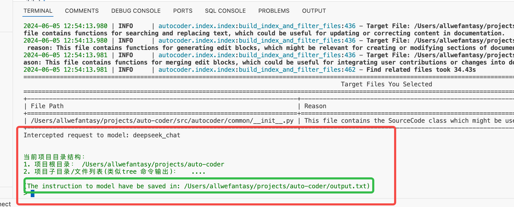
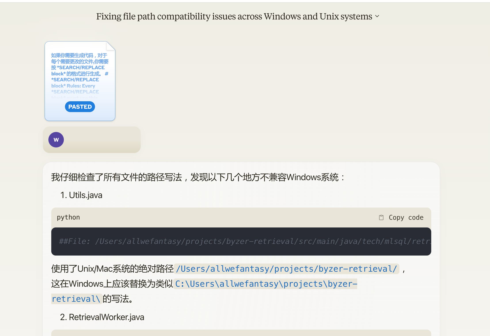
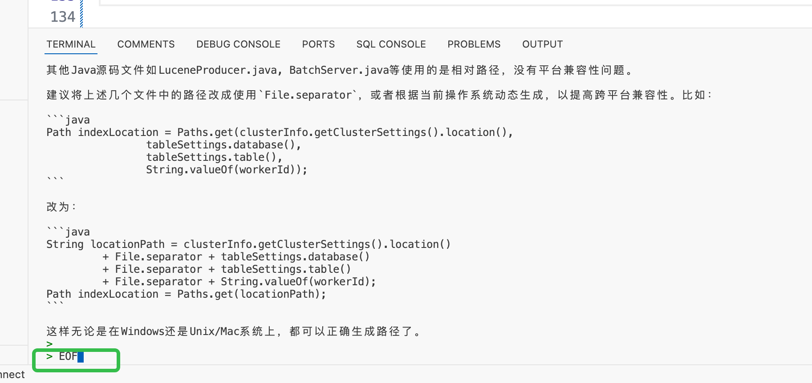

# 044_AutoCoder_新手顺手指南

当你完成了第一篇内容 [000-AutoCoder_准备旅程](./000-AutoCoder_准备旅程.md),你应该把你电脑的开发环境设置好了。


设置好环境后，务必阅读下这篇文章：[037-AutoCoder_项目快速修bug实战](./037-AutoCoder_项目快速修bug实战.md)来了解 auto-coder 的基本使用流程，当你阅读完这篇内容之后，你应该在脑海里形成一个全新的开发流程。

您的开发新方式是：

1. 编写一个YAML文件来描述您的需求，Auto-Coder将生成代码并将代码合并到您的项目中。
2. 检查Auto-Coder的提交，并在vscode或其他IDE中审查被提交的代码。
3. 如果提交是基本满意，您可以选择使用github copilot或其他工具手动对代码进行微调，或者直接继续下一步工作。
4. 如果提交的代码不满足你需求，您需要撤销提交并修改YAML文件，重新执行。
5. 重复上述步骤，直到完成你的需求。

好了。有了大概之后，我们就可以开始看看细节。

## 如何把已有老项目auto-coder化

如果你有一个老项目，你想把它auto-coder化，你可以使用 

```bash
auto-coder init --source_dir /path/to/your/project
```

更多内容参考这篇： [021-AutoCoder初始化项目](./021-AutoCoder初始化项目.md)。

最重要的是会在你的项目里新增一个 actions 目录。 目录里有一个 `000_example.yml`。

我们知道，我们是通过在 yml 文件描述自己的需求或者对代码的修改逻辑，然后auto-coder 会完成对项目源码的修改。这里
你的第一步不是去修改 000_example.yml，而是从新建一个新的 yml 文件开始：

```bash
auto-coder next "我的第一个修改"
```

系统会自动在 actions 目录下创建一个新的文件 `001_我的第一个修改.yml`,并且会自动打开这个文件（vscode/idea都支持）。

## 如何和 Yaml 文件交互

001_我的第一个修改.yml 实际自动帮你拷贝了000_example.yml的内容,所以他的内容是这样的：

```yaml

include_file:
  - ./base/base.yml
  - ./base/enable_index.yml
  - ./base/enable_wholefile.yml    

query: |
  YOUR QUERY HERE
```

这个yaml文件引入了一些基础配置，诸如 base.yml, enable_index.yml, enable_wholefile.yml。

1. base.yml 是一个基础配置，里面包含了一些基础的配置，比如你的项目的根目录，你的项目的语言，你使用的模型等。
2. enable_index.yml 开启索引。
3. enable_wholefile.yml 确定代码的生成和合并模式。

你可能唯一需要修改是 project_type 字段，该字段默认为 py。 如果你的项目是其他语言，你需要修改这个字段,你可以直接使用后缀名。比如你是一个java项目，那么最后的配置看起来是这样的：

```yaml
include_file:
  - ./base/base.yml
  - ./base/enable_index.yml
  - ./base/enable_wholefile.yml    

project_type: .java
query: |
  YOUR QUERY HERE
```

除了该参数以外，强烈建议你遵循默认配置。

你唯一要做的就是修改 query 字段。query 字段是一个多行字符串，你可以在这里写你的需求。

如何去描述你想对项目的更改，参考 [038-AutoCoder_为什么你需要经过反复练习才能用好](./038-AutoCoder_为什么你需要经过反复练习才能用好.md) 以及 [036-AutoCoder_编码_prompt实践_1](./036-AutoCoder_编码_prompt实践_1.md)。

## 运行 YAML 并且完成交互

当你完成了你的需求描述，你可以使用下面的命令来运行你的YAML文件：

```bash
auto-coder --file ./actions/001_我的第一个修改.yml
```

该命令执行后，会需要你和进行两次交互：

1. auto-coder 会根据你的描述，找到你需要修改以及为了完成这些修改还可能需要的文件，这是一个大绿屏。
2. 到最后的代码生成环节，auto-coder 会停下来，等待你的输入。

### 第一次交互

我们来看看第一个交互，也就是那个大绿屏：


这大绿屏其实展示了两个部分：

1. 根据你的 query 描述，auto-coder 找到的相关文件。 
2. 文件名后面的其实还有一部分，就是告诉你为什么这个文件被选上了。

默认都被勾选上，在这个环节你可能需要注意几个问题：

1. 路径必须是绝对路径。如果给出的是相对路径，那么要么是模型抽经，要么就是auto-coder 没有正确的拿到目录信息。你可以到群里咨询这个问题。
2. 这里罗列文件可能有没有实际存在的文件，但是auto-coder 会最终检查是不是存在，所以你不用担心这个问题。
3. 为什么这个环节只允许用户去掉一些文件，而无法新增一些文件。减少文件时因为我们需要减少给大模型的输入，避免超出模型的限制。如果你想要auto-coder关注的文件没有在这里，那么你有两种选择，第一个是取消然后回去修改yaml, 手动 @下你的文件名，类名或者函数名。或者你可以通过 urls 参数手动执行必须关注的一些文件。

你用 Tab 切换到 OK ，点击回车就会继续下一步,此时这个大绿框会消失,然后会展示绿框中的列表。

稍等几秒，我们会进入第二次交互

### 第二次交互



这个过程，auto-coder 会停下来，然后告诉你,我已经把我能收集到的信息都放到 output.txt 文件啦。
你现在可以把这个output.txt 给到大模型。 然后你把这个output.txt 的内容拖拽到任何一个大模型的 web 页面力就可以：



然后他就开始卡卡卡给你生成代码。代码生成完之后，你有两个选择：

1. 让auto-coder 帮你完成代码的合并。
2. 你自己完成后续的流程，比如代码合并。

这个第二次交互带来的价值有两点，第一点是现在 web 版的大模型可选的非常多，可以包月，或者直接免费。
第二点是，你可以看看生成结果靠不靠谱，毕竟有界面，看着舒服。

#### auto-coder 帮你合并代码

我们回国头来看你的选择,如果你选择让 auto-coder 帮你合并代码，那么你可以把 web 大模型的回复拷贝下，然后黏贴到 auto-coder 的命令行里。
然后换一个新行，输入 EOF，然后再次回车,表示我结束啦。



这里特别要注意两点：

1. 你要需要黏贴完整的回复，而不是代码部分。
2. EOF 要在独立的一行，并且是最后一行。

此时 auto-coder 会做完后续的事情，然后你就可以在 vscode/idea 里看到 commit 记录了。


#### 你自己合并代码

这个时候你 control + c 退出 auto-coder，然后根据大模型给出的答案，你自己对已有的代码做修改。

### 如何控制这些交互

1. skip_confirm 参考设置为 true, 可以跳过第一次交互,默认为 false。
2. human_as_model 设置为 false, 可以跳过第二次交互,默认为 true。参考这里: [human_as_model](./003-%20AutoCoder%20使用Web版大模型，性感的Human%20As%20Model%20模式.md)
3. auto_merge 可以控制生成的代码样式以及合并方式，默认为 wholefile。参考这里: [auto_merge](./035-AutoCoder_auto_merge详解.md)


## 总结

默认的设置对用户使用已经足够友好。用户唯一需要控制的是 auto_merge 参数，在 wholefile,diff,editblock 三者之间选择。
editblock 适合针对多文件，每个文件修改不大的情况， wholefile 则适合新文件生成。用户目前需要自己判断下这个需求用哪个比较好。

什么，这些参数要配置在哪里？ 放到 `001_我的第一个修改.yml` 里就可以了。后续如果你通过 auto-coder init 新增文件，他会自动拷贝上一个的配置过去。


