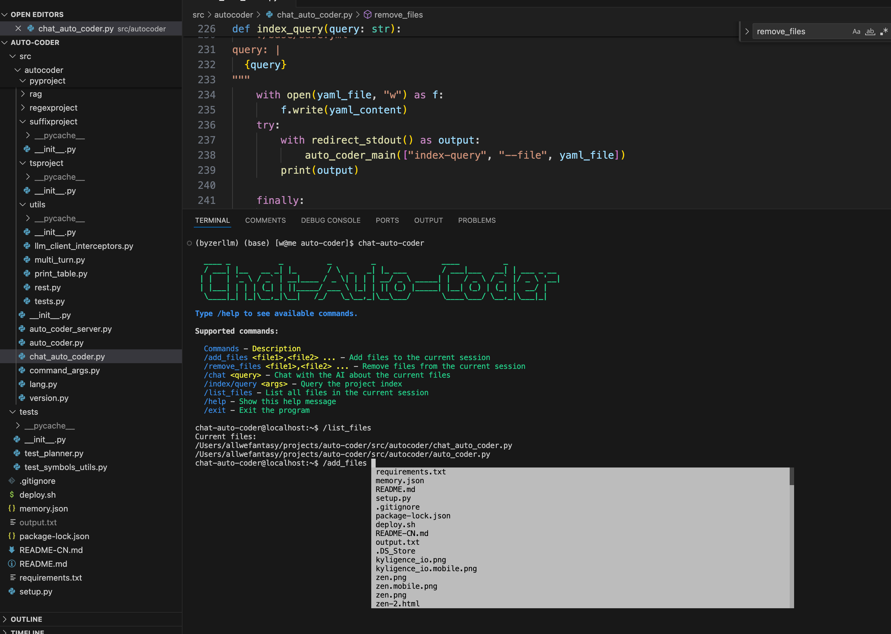
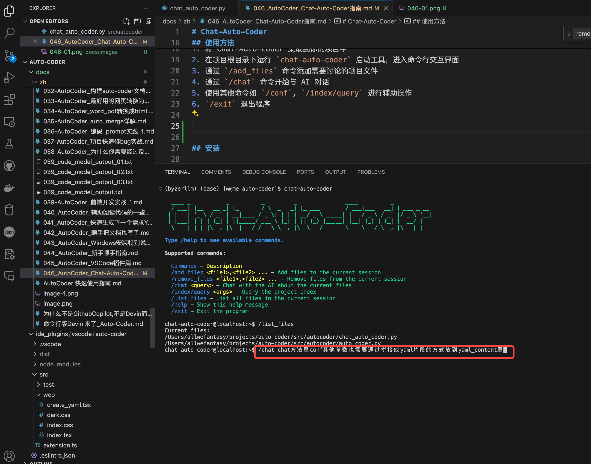
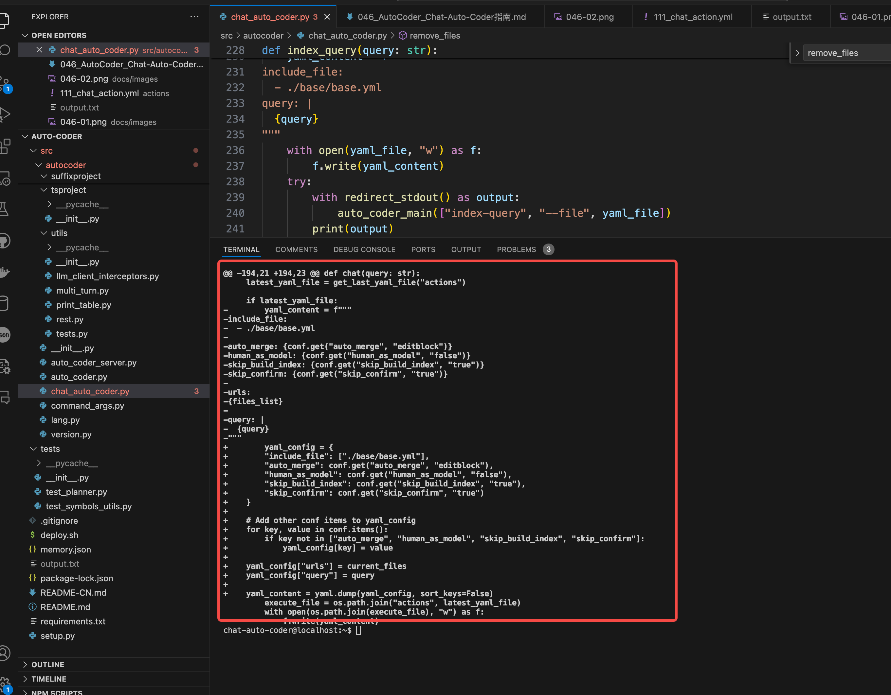

# Chat-Auto-Coder

Chat-Auto-Coder 是一款基于 AutoCoder 开发的交互式聊天工具,可以让你以对话的方式与 AI 进行沟通,可以无需打开编辑器，就能完成代码的开发。



## 功能特点

- 支持添加/移除项目文件到当前会话中
- 支持与 AI 就选定文件进行对话交流 
- 支持查询项目索引，获得相关文件
- 支持配置 AI 生成代码的参数
- 命令行交互界面,操作便捷
- 完善的自动补全功能

## 使用方法

1. 将 Chat-Auto-Coder 集成到你的项目中
2. 在项目根目录下运行 `chat-auto-coder` 启动工具，进入命令行交互界面
3. 通过 `/add_files` 命令添加需要讨论的项目文件  
4. 通过 `/chat` 命令开始与 AI 对话
5. 对上次commit的代码不满意，可以通过 `/revert` 命令进行回滚
6. 使用其他命令如 `/conf`, `/index/query` 进行辅助操作
7. `/exit` 退出程序


比如我想修改一个然后我只需要说出需求即可：



然后 AI 会自动修改代码，你可以看到修改结果：



你也可以打开编辑器自己再改改。

## 安装

该命令被包含在 `auto-coder` 包中，你可以通过以下命令安装。你可以参考以下文档来安装配置 `auto-coder`。

[](./000-AutoCoder_准备旅程.md)


## 示例

```shell
add_files main.py,utils.py
Added files: ['main.py', 'utils.py']
/chat 在main中新添加一个hello方法
... (AI 直接修改代码，然后你可以看到修改结果)
/conf human_as_model: true
Set human_as_model to true (这个时候可以拦截auto-coder 和大模型的交互)
/index/query 查找所有调用了 request 库的文件
... (返回查询结果)
/exit
Exiting...
```

## 常见问题

Q: 如何选择项目文件?
A: 使用 `/add_files` 命令,多个文件用逗号分隔。文件路径支持自动补全。

Q: AI 生成的代码如何合并?
A: 默认使用 editblock 方式合并。你可以通过 `/conf auto_merge: xxx` 命令修改合并方式。

Q: Chat-Auto-Coder 适合什么样的项目?
A: 理论上支持任何编程语言的项目。但建议项目文件数不要过多,否则可能影响效率。
  