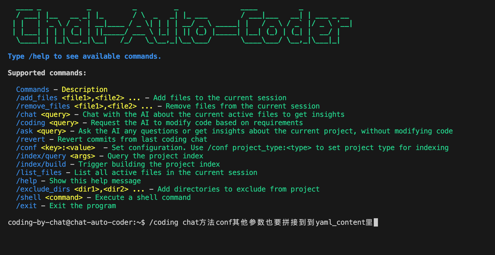

# Chat-Auto-Coder

Chat-Auto-Coder 是一款基于 AutoCoder 开发的交互式聊天工具,可以让你以对话的方式与 AI 进行沟通,可以无需打开编辑器，就能完成代码的开发。


## 功能特点

- 支持添加/移除项目文件到当前会话中
- 支持与 AI 就选定文件进行对话交流 
- 支持查询项目索引，获得相关文件
- 支持阅读项目
- 支持配置 AI 生成代码
- 命令行交互界面,操作便捷
- 完善的自动补全功能


## 使用方法

* 将 Chat-Auto-Coder 集成到你的项目中
* 在项目根目录下运行 `chat-auto-coder` 启动工具，进入命令行交互界面
* 通过 `/conf project_type:xxx` 配置项目类型,支持后缀名，比如 .py, .java, .js多个按逗号分隔。 提供了两个快捷方式： py 和 ts
* 运行 `/index/build` 根据 project_type 选择文件构建文件索引。
* 通过 `/ask` 命令开始与 AI 对话,了解该项目
* 通过 `/add_files` 命令添加需要讨论的项目文件  
* 通过 `/chat` 可以随意聊天或者针对`/add_files` 内容提问。
* 通过 `/coding` 让 AI 为你生成代码
* 对上次commit的代码不满意，可以通过 `/revert` 命令进行回滚
* 通过 `/conf code_model:xxxx`  配置代码生成模型。
* 通过 `/conf human_as_model:true` 设置人类作为模型
* 通过 `/conf skip_build_index:false` 设置自动开启索引，当你进行 /coding 时，会自动寻找相关文件
* 使用其他命令如 `/index/build`， `/index/query` 可以构建和查询索引
* `/exit` 退出程序
* `/shell` 可以执行shell命令


比如我想修改一个然后我只需要说出需求即可：



然后 AI 会自动修改代码，你可以看到修改结果：


你也可以打开编辑器自己再改改。

## 设置代码生成模型

Chat-Auto-Coder 默认集成了 deespseek_chat 模型, 然而该模型现阶段在代码生成方面还存在问题，
我们强烈推荐设置下面的模型中的某一个作为编程模型。

1. Sonnet 3.5/ Opus 模型
2. GPT4o

具体做法：

```shell
easy-byzerllm deploy sonnet3.5 --token ${MODEL_CLAUDE_TOEKN} --alias sonnet_3_5_chat
```

然后你可以通过如下命令来来测试是否正常运行：

```shell
easy-byzerllm chat sonnet_3_5_chat hello
```

接着你可以通过 `/conf code_model:sonnet_3_5_chat` 来设置代码模型。

## 安装

快捷方式：

```bash
pip install -U auto-coder
chat-auto-coder
```

如果有问题，参考这篇更详细的：
[000-AutoCoder_准备旅程](./000-AutoCoder_准备旅程.md)


## 示例

```shell
/add_files main.py,utils.py
Added files: ['main.py', 'utils.py'] (关注你想修改的文件)
/coding 在main中新添加一个hello方法
... (AI 直接修改代码，然后你可以看到修改结果)
/conf human_as_model: true
Set human_as_model to true (这个时候可以拦截auto-coder 和大模型的交互)
/index/query 查找所有调用了 request 库的文件
... (返回查询结果,主要是你可能不知道哪些文件是你想改的，可以通过这个来自动找到，然后手动添加)
/exit
Exiting...
```

## 常见配置

1. human_as_model: 是否使用人类作为模型，默认为 false。 你可以通过 `/conf human_as_model: true` 来设置。[003-使用Web版本大模型，性感的Human As Model 模式](./003-%20AutoCoder%20使用Web版大模型，性感的Human%20As%20Model%20模式.md)
2. code_model: 代码生成模型，默认为 deepseek_chat。 你可以通过 `/conf code_model: xxxx` 来设置其他通过 byzerllm 启动的模型。 

## 了解项目，但不想改代码

可以用 `/ask` 指令， 可以回答和项目相关的任何问题。

或者通过 `/chat` 指令，可以随意聊天，或者针对`/add_files` 内容提问。

## 对项目不熟悉，但是又想改项目怎办？

默认我们是通过 `/add_files` 来添加 chat-auto-coder 关注的文件，这需要你清晰的知道你想修改的文件，以及为了修改这个文件，你还需要哪些文件。
为了帮助大家更好的找到文件，我们提供了半自动挡的 `/index/query` 命令，你可以通过这个命令来查找你想要的文件。
如果你想完全让 chat-auto-coder 自动找到你想要的文件，你可以通过如下配置开启：

```shell
/conf skip_build_index: false
```

当执行你的需求时，系统会自动寻找相关文件。全自动档速度较慢，并且可能存在找的文件不对。如果你想人工确认找到的文件，可以
通过如下配置开启确认步骤：

```shell
/conf skip_confirm: false
```

记得，`/conf` 配置的这些参数即使重启后依然会一直有效。

你可以通过如下指令查看当前所有的配置：

```shell
/conf
```

## 常见问题

Q: 如何选择项目文件?

A: 使用 `/add_files` 命令,多个文件用逗号分隔。文件路径支持自动补全。

Q: AI 生成的代码如何合并?

A: 默认使用 editblock 方式合并。你可以通过 `/conf auto_merge: xxx` 命令修改合并方式。


Q: Chat-Auto-Coder 适合什么样的项目?

A: 理论上支持任何编程语言的项目。但建议项目文件数不要过多,否则可能影响效率。
  